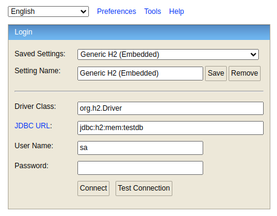

# Instructions to use this API

## Some info about this API

- Spring Boot version: `3.1.5`
- Java version: `21`
- Dependencies:
  - spring jpa
  - devtools
  - h2 database
  - lombok
  - spring boot validation
  - springdoc openapi _(swagger)_

## Accessing the H2 Database



```sh
Driver Class: org.h2.Driver
JDBC URL: jdbc:h2:mem:testdb
User Name: sa
Password: sa
```

## Using Swagger-UI

This API is documented using Swagger OpenAPI.

All you need to do is run the application and paste the url below to access the documentation.

```sh
http://localhost:8080/swagger-ui-custom.html
```

## IDE used in this project

Intellij was the choice here because of the following points:

- This IDE has very modern UI
- Easy to access all of its features
- Great integration with Maven
- Very easy to work with the keyboard if you like to use shortcuts
- Good suggestions to refactor the code
- Always saves anything we add
- Shift+F6 is a lifesaver when you need to change the name of a class or variable 
- I find it very intuitive, and if I don't know how to do some stuff, there is the `Learn` tab which has tons of content about how to use the IDE
- The debugger shows a lot of valuable information about the process
- Is very easy to run a code. If you have a MacBook M1 with touch bar, the `run button` is shown there
- Code completion, code generation and more are always very handy